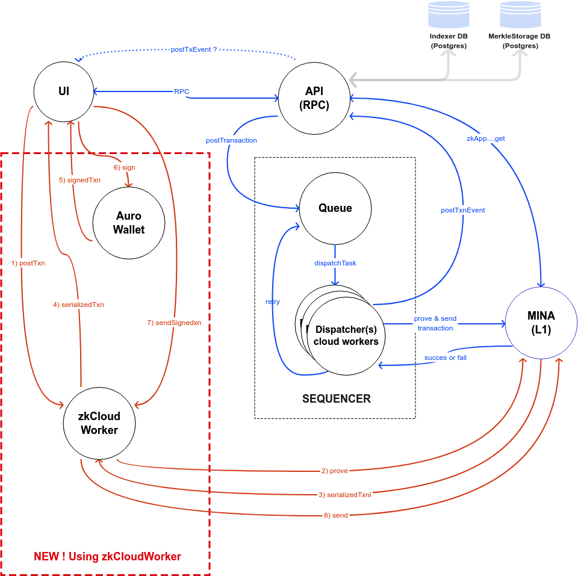
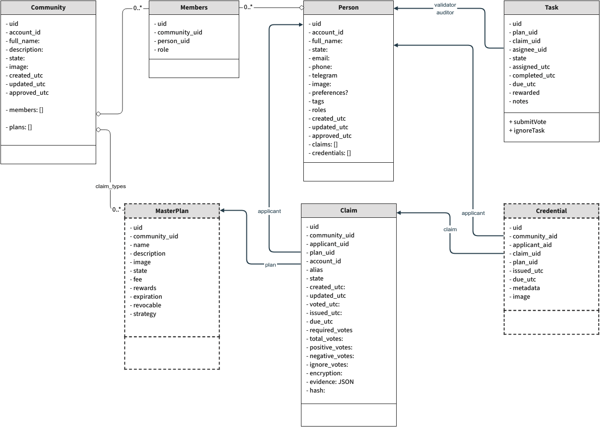
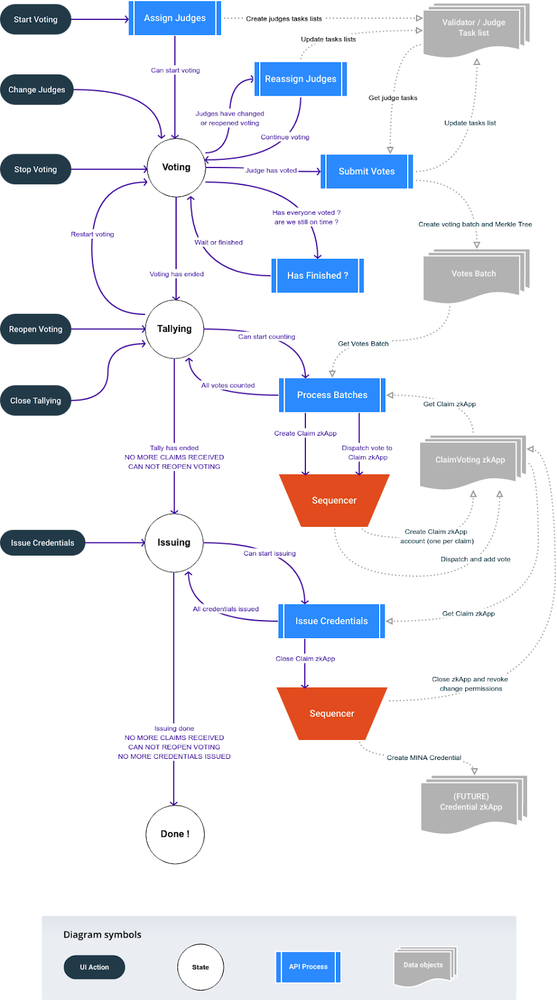
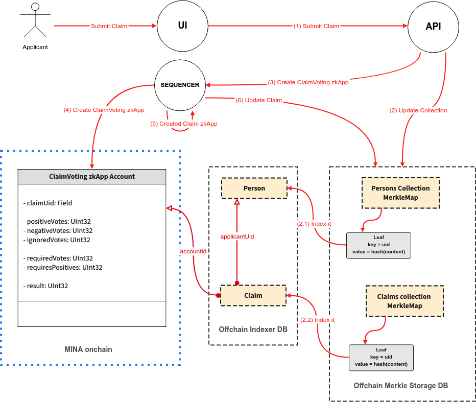
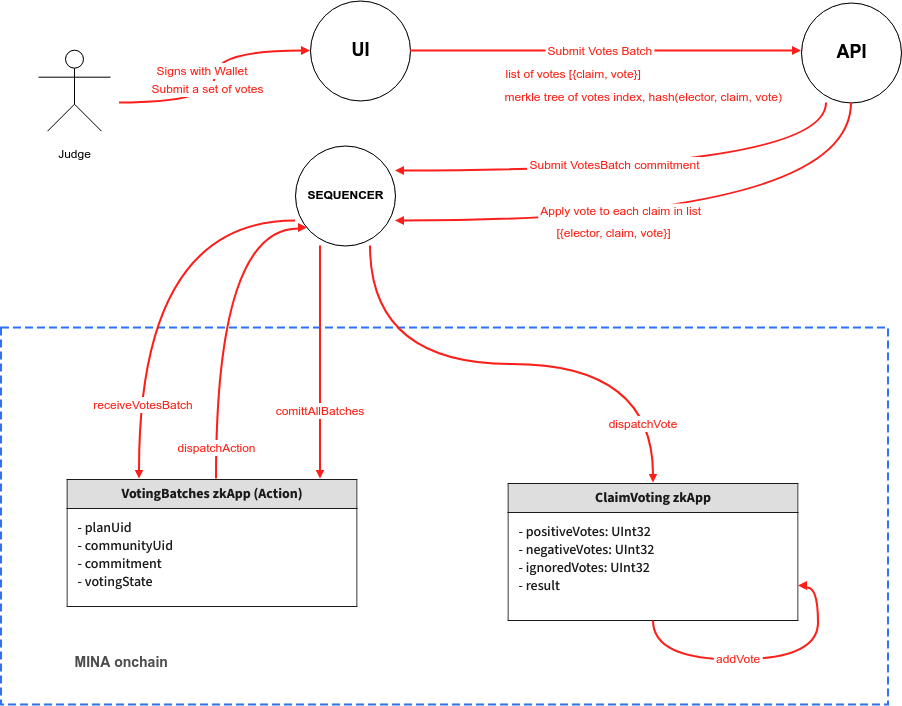

# Architecture

The current (already running) architecture of Socialcap is shown in this diagram:

;

## Components
 
Her it follows a brief descriptions of components:

### **UI** 

Is the web app [my.socialcap.dev](https://my-socialcap-dev.vercel.app) used by final users, admins and electors. It is fairly known and running in production, so we will not detail it here.  One key point is that it is basically a Web2 app, using a remote API, and including minimal access to o1js.  Because of the impact in usability and UX we do not do any proving (only signing data with the wallet) on the web app itself, delegating this to the cloud workers (dispatchers).

### **API (RPC)** 

This a traditional web API backend, implementing 2 sets of RPC methods: queries and mutations. A reference of the methods can be found in the API reference docs (WIP).

It manages all interactions with the UI, the Indexer Db, and the Merkle maps storage. All interactions with MINA happen by posting transactions to the Sequencer.

### **SEQUENCER QUEUE(s)**

All transactions end in this queue manager, which can have many running queues each binded to a given process. For example, all transactions that will apply to a given zkApp claim will be managed by the same queue, identified by its ‘claim-uid’. 

The sequencer then manages the set of queues, and decides when to send a transaction in a given queue to a given dispatcher. It also manages retry and the success or failure of transactions. More info in the  [Sequencer code](https://github.com/Socialcap-app/socialcap-services/tree/main/src/sequencer).

### **DISPATCHERS**

Dispatchers are small workers running in the Socialcap server, that expose a very simple API to the Sequencer. Most o1js code is here, and they do all the creation, proving and sending of transactions. As described in the zkCloudWorker proposal they provide very fast proving times.

Here is an examples of the [CreateClaimVotingAccount Dispatcher](https://github.com/Socialcap-app/socialcap-services/blob/main/src/sequencer/dispatchers/create-claim-voting-account.ts).

Each dispatcher is bonded to a given MINA Account which pays the transaction fees. We are currently using 10 simultaneous dispatchers, so we can parallelize transactions sent to MINA.

### **THE NEW zkCloudWorker**

In red in the diagram, we are showing how we plan to use the new zkCloudWorker, replacing some of the Dispatchers with this new worker.

### **DATA MODEL**

The current data model, as stored in the Indexer Db is crucial for the UI navigation and a performant UX, is (slightly outdated, full schema is in the [Prisma schema](https://github.com/Socialcap-app/socialcap-services/tree/main/prisma). 
Entities in this data model constitute what we generally call the “Collections”: lists of persons, members, communities, claims, master plans, and tasks. 

 
## The voting process

Here we briefly present the current full voting process: states, associated processing and involved data objects.

## Actions and events

This is what happens when an applicant submits his/her claim: a new ClaimVoting zkApp is created on the fly. 

 
This is the sequence of actions that happen when an elector dispatches his/her  votes for a given set of claims:

**ClaimVoting contract and Actions**

An important design decision regarding the ClaimVoting contract is how we are using Actions. We are NOT using the reducer, because we are counting votes any time the dispatchVote() method is called. Assertion of vote validity is done in this method and also evaluation of the result.

BUT we are dispatching an action for each valid vote received and counted. This is done to provide traceability of the voting process, by storing the full history of received votes in a given claim. These actions ar stored in the MINA Archival nodes, and so they can be later retrieved and checked in case of doubts.