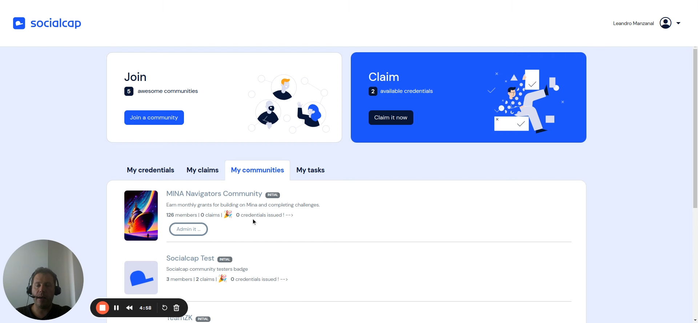

# Admin your Community

**Summary**

In this video, I walk you through all the available features for our community. We start by setting up the community's name, description, and image, and then move on to defining the master plans, which determine the behavior of the claims. I also show you how to manage members and promote them to validators. Additionally, I explain how to view and filter claims, download applicant information, and use the voting and devoting sections as an admin. Watch this video to learn more about our community's features and how to navigate them.

- 0:00 Introduction
- 0:40 Setting Up Master Plans
- 1:21 Viewing and Filtering Claims
- 2:01 Understanding Columns and Evidence
